# 毕业设计以信息技术知识竞赛系统为题可以这么写

<h4 style='color:red'>联系不到我，就看我的主页 </h4> 
 
#### 介绍

毕业设计怎么写？介绍一款springboot框架开发的系统。基于Spring Boot的信息技术知识竞赛系统是一款集在线学习、知识竞赛、赛事管理和用户管理于一体的综合平台。系统设有两种角色：管理员和用户，分别满足系统管理和用户参与竞赛的需求。通过该系统，管理员可以高效地管理竞赛和学习资源，而用户可以便捷地进行在线学习和参与知识竞赛。

#### 研究背景

当前的网络技术，软件技术等都具备成熟的理论基础，市场上也出现各种技术开发的软件，这些软件都被用于各个领域，包括生活和工作的领域。随着电脑和笔记本的广泛运用，以及各种计算机硬件的完善和升级，市面上的电脑和笔记本的性能都得到提升，可以支持的软件也逐渐增多，因此，在计算机上安装软件来发挥其高效地信息处理的作用，则很受人们的青睐。对于信息技术知识赛系统信息来讲，通过手工形式处理，在面对庞大的信息数量时，就显得不适宜了，首先需要花费的时间比较多，其次数据出错率比较高，而且对错误的数据进行更改也比较困难，最后，检索数据费事费力。因此，为了解决上述问题，有必要建立信息技术知识赛系统，来规范信息技术知识赛系统信息管理流程，让管理工作可以系统化和程序化，同时，信息技术知识赛系统的有效运用可以帮助管理人员准确快速地处理信息。

#### 技术栈

后端技术栈：Springboot+Mysql+Maven

前端技术栈：Vue+Html+Css+Javascript+ElementUI

开发工具：Idea+Vscode+Navicate

#### 系统功能介绍

管理员角色功能模块  
个人中心：管理员可以管理个人信息，修改密码，确保账户安全。  
管理员管理：管理员可以添加、删除和修改其他管理员的权限和信息，确保系统的多管理员管理机制。  
在线学习管理：管理员可以管理学习资源的上传、分类和发布，确保学习资料的及时更新和合理分类。  
基础数据管理：管理员可以维护系统的基础数据，包括用户信息、题库信息等，确保系统数据的完整性和准确性。  
赛事论坛管理：管理员可以管理论坛的帖子和回复，确保论坛的内容健康和有序。  
公告信息管理：管理员可以发布和管理系统公告，确保重要信息的及时传达。  
赛事信息管理：管理员可以管理各类知识竞赛的信息，包括竞赛的时间、地点、规则等。  
赛事报名信息管理：管理员可以查看和管理用户的报名信息，确保竞赛报名的有序进行。  
用户管理：管理员可以查看和管理用户信息，包括用户的注册、注销和权限分配，确保用户数据的安全和准确。  
测卷管理：管理员可以管理试卷的制作和分发，确保试卷的合理性和准确性。  
试题管理：管理员可以添加、修改和删除试题，确保题库的及时更新和合理分类。  
测试管理：管理员可以发布和管理各类测试，包括测试的时间、内容和评分标准等。  
轮播图信息管理：管理员可以管理系统主页的轮播图，确保轮播图的内容新颖和相关。  

用户角色功能模块  
在线学习：用户可以在线浏览和学习系统提供的学习资源，提升自身的知识水平。  
测卷表：用户可以查看和参与系统提供的各类测试，检验自己的学习成果。  
赛事论坛：用户可以在论坛上发布帖子和回复，参与讨论，分享学习心得和竞赛经验。  
公告信息：用户可以查看系统发布的公告，及时获取重要信息。  
赛事信息：用户可以查看各类知识竞赛的信息，包括竞赛的时间、地点、规则等。  
个人中心：用户可以管理个人信息，修改密码，确保账户安全。  
后台管理：  
个人中心：用户可以在后台管理个人信息，修改密码。  
在线学习管理：用户可以在后台管理个人的学习资源，包括浏览和下载学习资料。  
赛事论坛管理：用户可以在后台管理个人的论坛帖子和回复，确保论坛内容的健康和有序。  
公告信息管理：用户可以在后台查看和管理个人关注的公告信息。  
赛事信息管理：用户可以在后台查看和管理个人关注的赛事信息。  
赛事报名信息管理：用户可以在后台查看和管理个人的报名信息。  
测试管理：用户可以在后台管理个人的测试信息，包括查看测试成绩和参与新的测试。  

#### 功能结构设计

为了让系统的编码可以顺利进行，特意对本系统功能进行细分设计，设计的系统功能结构见下图。

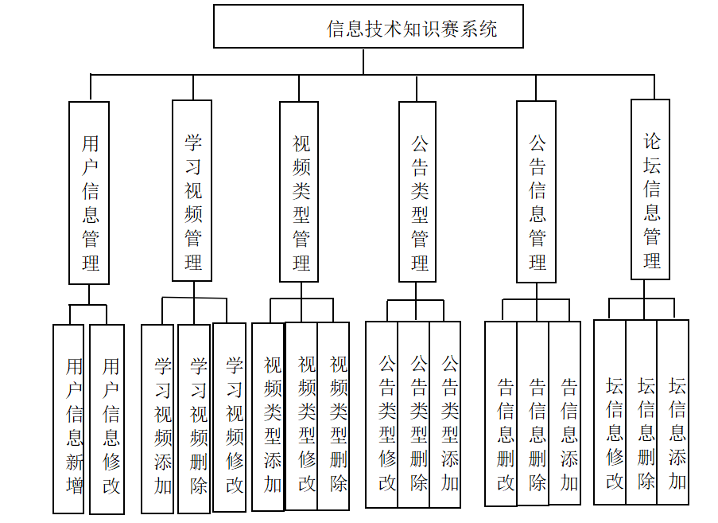

#### 系统流程分析

本系统在处理数据时，其内部的操作逻辑也需要使用相应的工具进行展示。
在本系统的数据录入页面，对于操作者提供的每条数据都有相应的检验规则，比如数据信息不能有非法字符，或者本来应该是汉字的数据，不能用字母代替，还有对数据内容的长度等进行规范，这样的可以确保数据准确性的检验规则，在编码时，就提前编写好了。数据添加的流程见下图。如果数据已经保存进入数据库，则说明操作者提供的数据内容和格式都是符合要求的。

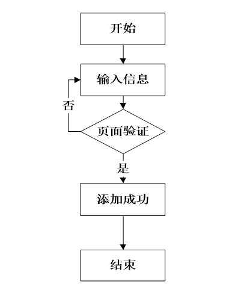

很多时候，面对系统中的大量数据，难免会发现一些错误，因此需要及时纠正错误，本系统也提供数据后期的修改功能，其流程见下图。但是更新的数据也需要通过数据有效性检验。能够最终写入数据库则说明修改的数据是符合要求的。

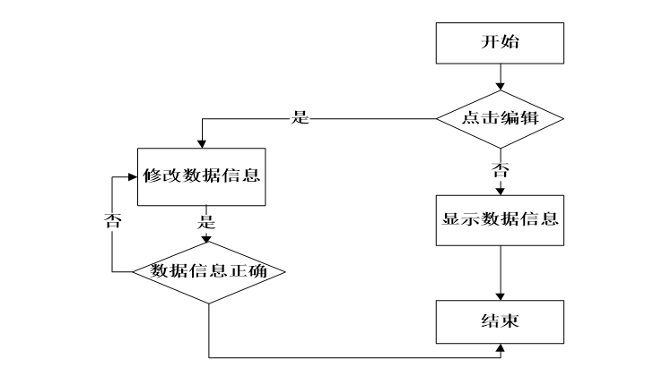

面对数据库里面大量数据，在系统的前台，要想快速获取需要的信息，就需要使用查询功能。其流程见下图。该功能需要操作者提前输入关键词，当系统的后台数据库保存了与关键词匹配的数据时，就会及时显示出来，整个过程耗时很短。

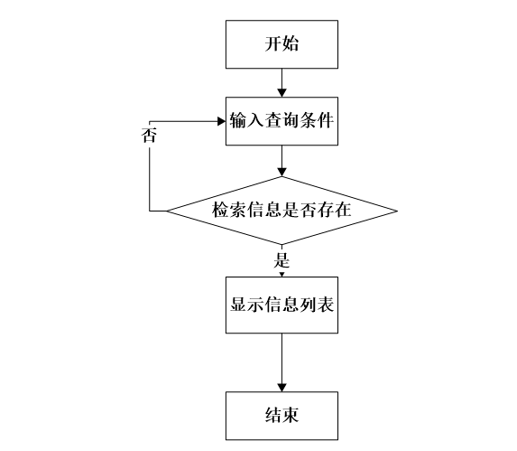

#### 系统作用

基于Spring Boot的信息技术知识竞赛系统在现代教育和信息管理中具有重要的作用：

提升学习效率：通过在线学习和测验，用户可以自主安排学习时间，提高学习效率。  
优化竞赛管理：通过系统化的赛事管理，管理员可以高效组织和管理各类知识竞赛，确保竞赛的公平和有序。  
促进知识交流：通过赛事论坛，用户可以分享学习心得和竞赛经验，促进知识的交流和传播。  
增强信息透明度：通过公告信息管理和赛事信息管理，系统确保了重要信息的及时传达和透明，用户可以随时获取最新信息。  
提高管理效率：通过后台管理功能，管理员可以高效管理系统各类资源和用户信息，提高管理效率。  

#### 系统功能截图

登录模块

在线学习模块

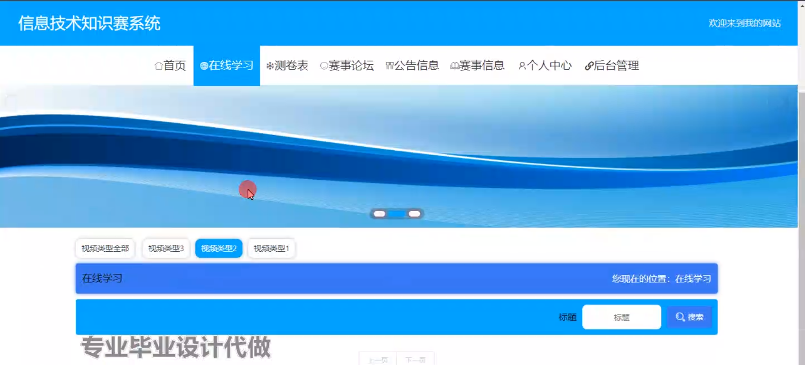

赛事论坛

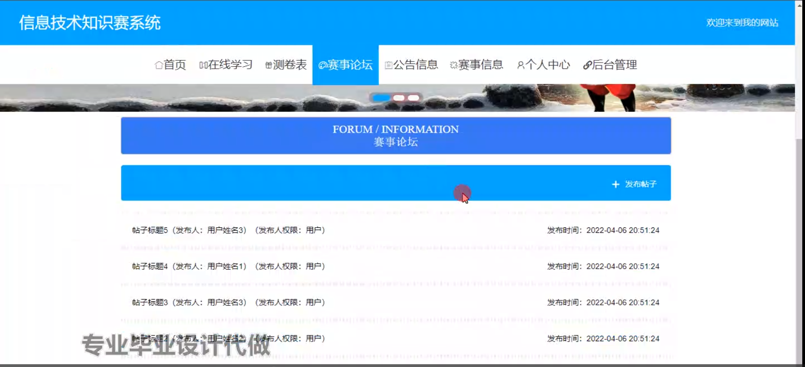

公告信息

个人中心

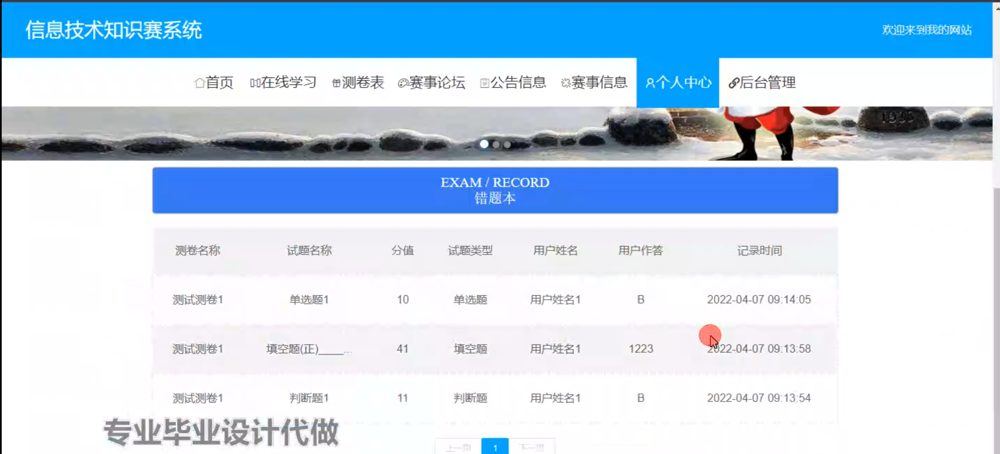

赛事信息

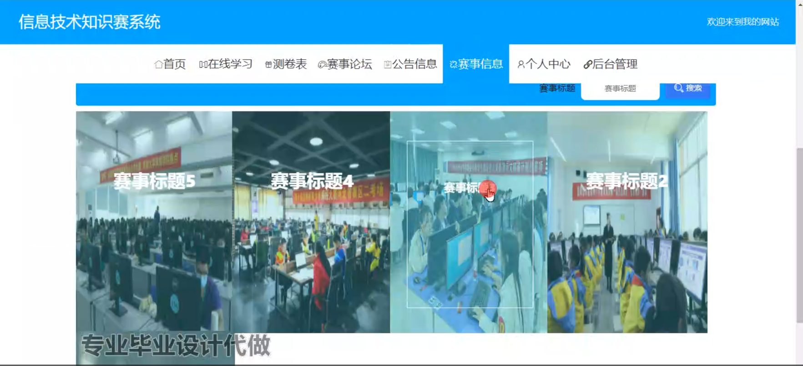

赛事信息管理

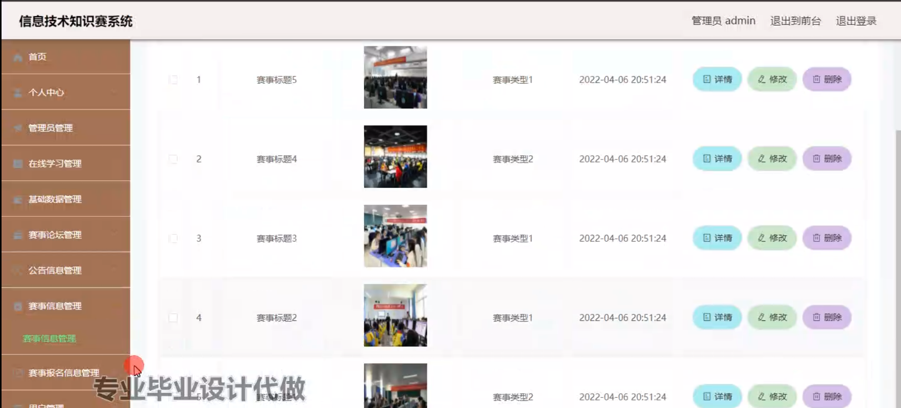

赛事报名信息管理

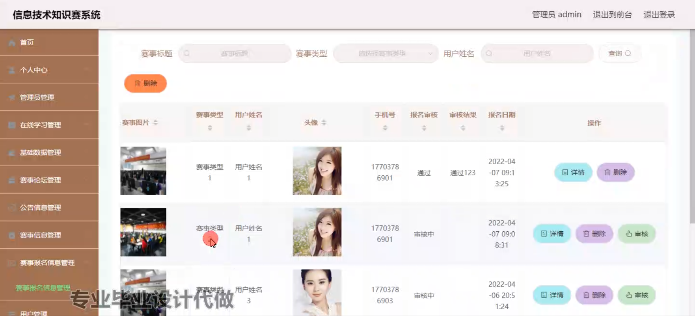

试题管理

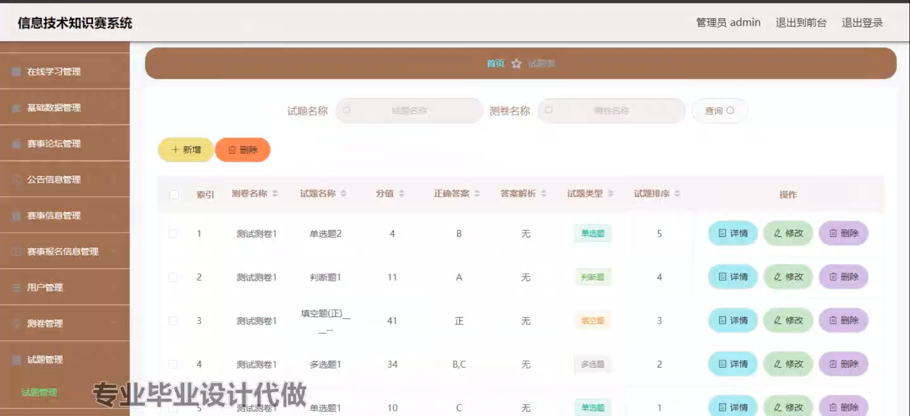

用户端后台管理

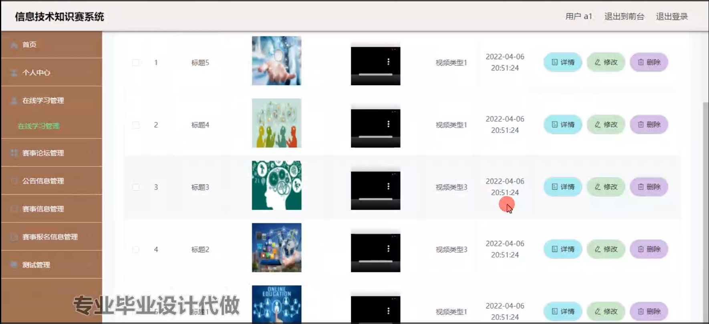

测试管理

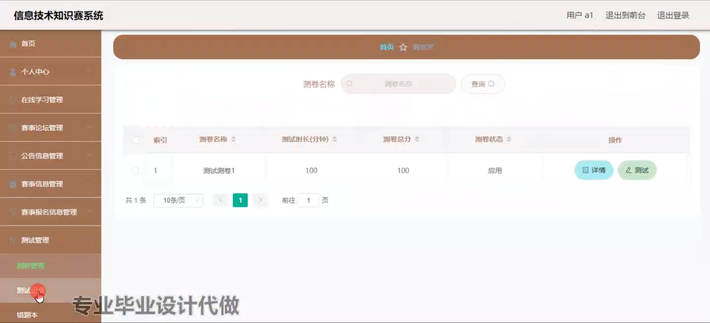

#### 总结

基于Spring Boot的信息技术知识竞赛系统在现代教育和信息管理中发挥了重要作用。系统通过全面的功能模块设计，满足了管理员和用户的不同需求，优化了学习和竞赛的流程，提升了学习效果和管理效率。然而，系统在实际应用中可能存在一些局限性，如功能的扩展性和用户体验的进一步优化。未来，该系统可以结合更多的智能技术，如数据分析和人工智能，实现更为精准和高效的知识竞赛和学习管理。通过不断的优化和升级，基于Spring Boot的信息技术知识竞赛系统将为现代教育和信息管理的发展提供更强大的支持和保障。

#### 使用说明

创建数据库，执行数据库脚本 修改jdbc数据库连接参数 下载安装maven依赖jar 启动idea中的springboot项目

前台登录页面
http://localhost:8080/xinxijishuzhishisai/front/index.html

后台登录页面
http://localhost:8080/xinxijishuzhishisai/admin/dist/index.html

管理员				账户:admin 		密码：admin

用户				账户:a1 		密码：123456
